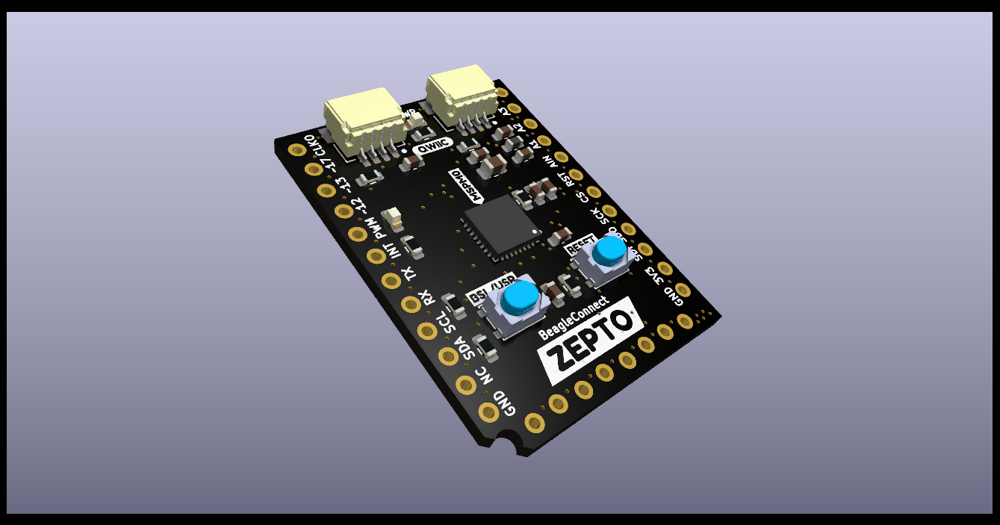
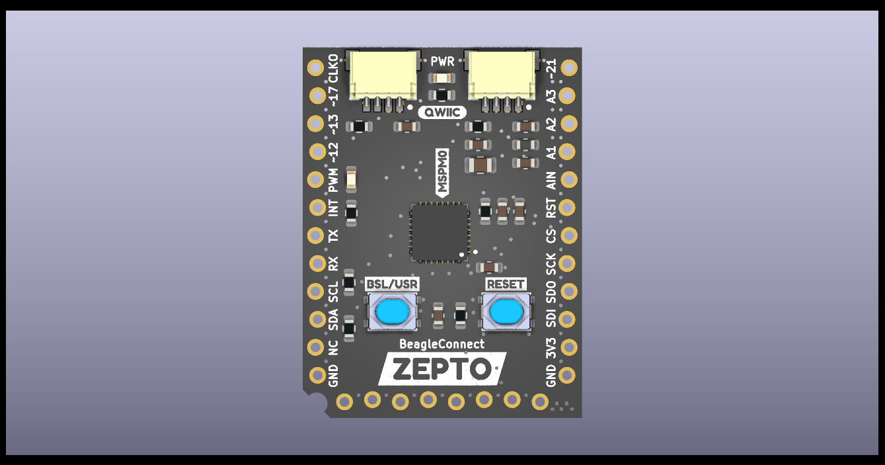
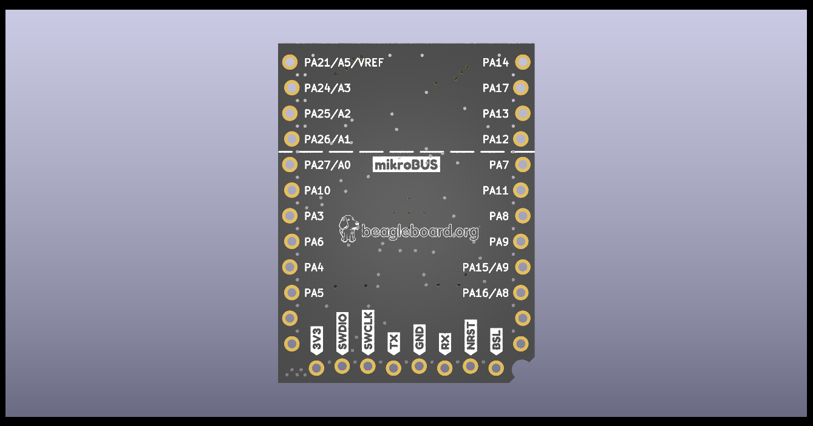
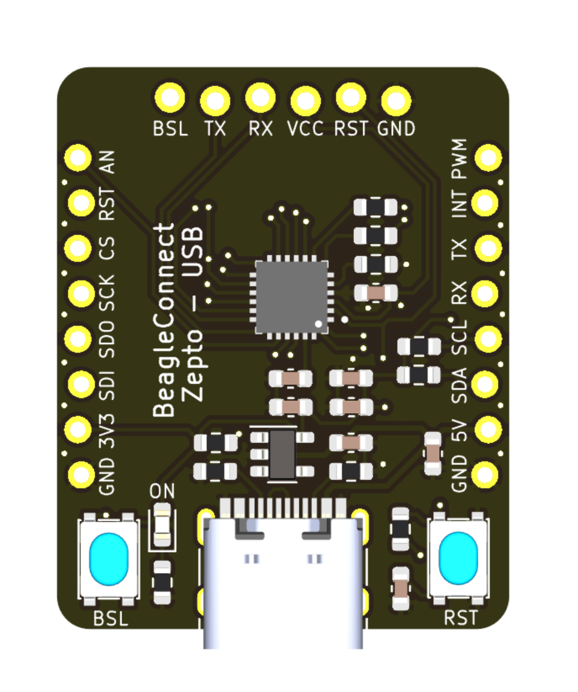
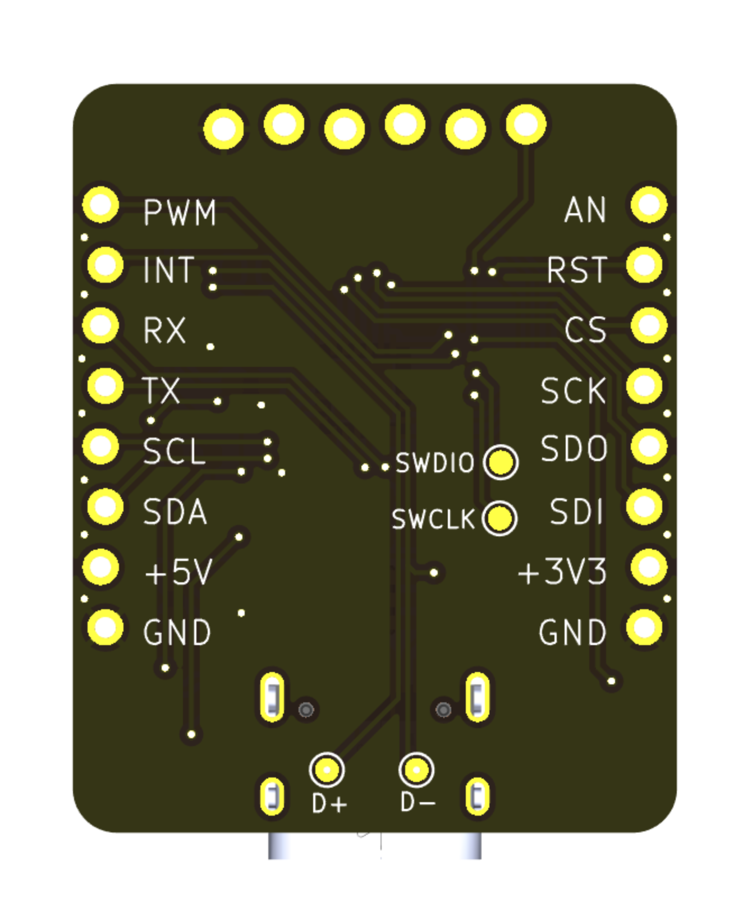

# BeagleConnect Zepto

| Front           |  Back |
| :-------------------------: | :-------------------------: |
|   |  |

* USB version has 1x USB + 1x JST
* JST version has 1x JST (power in) + 1x JST (power out)

## Hardware

* MSPM0 processor
* Friction-fit mikroBUS
  * No bottom-side components allow solder-down
* 1" square PCB
* QWIIC-compatible JST-SH
  * Full Grove function I2C/UART/ADC/GPIO
* TAG-CONNECT JTAG
* BOOT/USER pin hole
  * Consider keeping button separate to avoid cost

## Software

* Zephyr-based SDK
  * MCUBOOT-based USB bootloader (hard to brick)
* BeagleConnect firmware exposing mikroBUS to Linux/Zephyr hosts
  * Gateway function on USB
  * Node function on both USB and JST
* Micropython firmware
* Microblocks
  * Based on Zephyr and Arduino Core
* USB-to-UART
* USB-to-JTAG

## Accessories (kit versions available)

* 4-pin JST-SH to 4-pin JST-SH
* mikroBUS to 10-pin TAG-CONNECT JTAG/SWD
* 4-pin JST-SH to FTDI header
* 4-pin JST-SH to BeagleBone AI-64 3-pin JST-SH
* 4-pin JST-SH to BeagleY-AI 3-pin JST-SH
* 4-pin JST-SH to BeaglePlay 3-pin 0.1" pin header

## Marketing

* Extremely low-cost with high-level software
* Fixed firmware load for >1,000 sensors using Linux gateway
* Everyone has a different name for specific JST, so we probably should too -- BC4 (BeagleConnect 4-wire)?

## Conceptual layouts

### Feedback

* I'm concerned the above doesn't have the 4-pin JST-SH connection that I believe it needs.
* I believe we should get to a 1" square layout.
* I believe we can get by without the buttons.
* The USB interface will change when we get the updated MSPM0 devices with FS USB. (No need to bit-bang)

***

# Editing this README

When you're ready to make this README your own, just edit this file and use the handy template below (or feel free to structure it however you want - this is just a starting point!).  Thank you to [makeareadme.com](https://www.makeareadme.com/) for this template.

## Suggestions for a good README
Every project is different, so consider which of these sections apply to yours. The sections used in the template are suggestions for most open source projects. Also keep in mind that while a README can be too long and detailed, too long is better than too short. If you think your README is too long, consider utilizing another form of documentation rather than cutting out information.

## Name
Choose a self-explaining name for your project.

## Description
Let people know what your project can do specifically. Provide context and add a link to any reference visitors might be unfamiliar with. A list of Features or a Background subsection can also be added here. If there are alternatives to your project, this is a good place to list differentiating factors.

## Badges
On some READMEs, you may see small images that convey metadata, such as whether or not all the tests are passing for the project. You can use Shields to add some to your README. Many services also have instructions for adding a badge.

## Visuals
Depending on what you are making, it can be a good idea to include screenshots or even a video (you'll frequently see GIFs rather than actual videos). Tools like ttygif can help, but check out Asciinema for a more sophisticated method.

## Installation
Within a particular ecosystem, there may be a common way of installing things, such as using Yarn, NuGet, or Homebrew. However, consider the possibility that whoever is reading your README is a novice and would like more guidance. Listing specific steps helps remove ambiguity and gets people to using your project as quickly as possible. If it only runs in a specific context like a particular programming language version or operating system or has dependencies that have to be installed manually, also add a Requirements subsection.

## Usage
Use examples liberally, and show the expected output if you can. It's helpful to have inline the smallest example of usage that you can demonstrate, while providing links to more sophisticated examples if they are too long to reasonably include in the README.

## Support
Tell people where they can go to for help. It can be any combination of an issue tracker, a chat room, an email address, etc.

## Roadmap
If you have ideas for releases in the future, it is a good idea to list them in the README.

## Contributing
State if you are open to contributions and what your requirements are for accepting them.

For people who want to make changes to your project, it's helpful to have some documentation on how to get started. Perhaps there is a script that they should run or some environment variables that they need to set. Make these steps explicit. These instructions could also be useful to your future self.

You can also document commands to lint the code or run tests. These steps help to ensure high code quality and reduce the likelihood that the changes inadvertently break something. Having instructions for running tests is especially helpful if it requires external setup, such as starting a Selenium server for testing in a browser.

## Authors and acknowledgment
Show your appreciation to those who have contributed to the project.

## License
For open source projects, say how it is licensed.

## Project status
If you have run out of energy or time for your project, put a note at the top of the README saying that development has slowed down or stopped completely. Someone may choose to fork your project or volunteer to step in as a maintainer or owner, allowing your project to keep going. You can also make an explicit request for maintainers.
